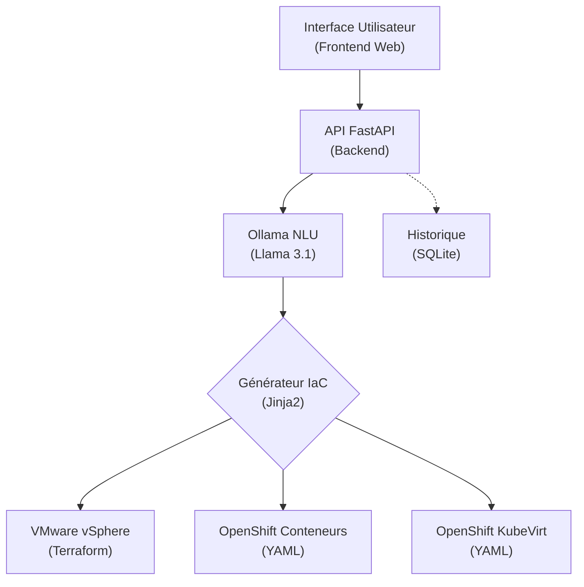

# IaC Chatbot Assistant

Une plateforme intelligente d'automatisation de l'infrastructure, basée sur l'Infrastructure as Code (IaC) et pilotée par un agent conversationnel en langage naturel (LLM).

## Architecture 



## Fonctionnalités principales

1. **Extraction de paramètres par IA** : Compréhension du langage naturel pour extraire les paramètres de déploiement (CPU, RAM, Stockage, OS, Plateforme).
2. **Génération IaC dynamique** : Création automatique de code Terraform (`main.tf`, `variables.tf`) pour VMware et de manifestes Kubernetes/KubeVirt (`.yaml`) pour OpenShift.
3. **Conversation multi-tours** : L'assistant relance l'utilisateur si les informations fournies sont incomplètes ou ambiguës.
4. **Validation métier Pydantic** : Empêche les demandes absurdes (ex: un conteneur sur VMware vSphere).
5. **Traçabilité totale** : Enregistrement de chaque requête (succès, échec, relance) dans une base de données locale SQLite.
6. **Interface Chat Web (Glassmorphism)** : Frontend moderne avec coloration syntaxique du code généré.

## Prérequis

- Python 3.13
- Ollama avec le modèle `llama3.1:latest` téléchargé
- Terraform (pour appliquer le code généré sur VMware)
- CLI OpenShift `oc` ou `kubectl` (pour appliquer le code sur OpenShift)

## Installation

1. **Cloner le projet**

2. **Créer et activer l'environnement virtuel**
```bash
python -m venv .venv
source .venv/bin/activate  # Sur Linux/Mac
.venv\Scripts\activate     # Sur Windows
```

3. **Installer les dépendances**
```bash
pip install -r requirements.txt
```

4. **Vérifier qu'Ollama fonctionne**
Assurez-vous que le service Ollama est lancé et que le modèle Llama 3.1 est disponible :
```bash
ollama list
```

## Démarrage

1. Lancer l'API FastAPI et le serveur Frontend (inclus) :
```bash
python backend/app/main.py
```

2. Ouvrir le navigateur à l'adresse :
**http://localhost:8000**

## Utilisation (Exemples de prompts)

- "Crée-moi une VM Ubuntu avec 4 CPU et 8 Go de RAM sur vSphere, 50 Go de disque"
- "I need a container running nginx on OpenShift with 2 cores and 4GB RAM"
- "Déploie un conteneur postgres sur openshift" (Va déclencher une question de relance pour les specs manquantes)

## Pipeline CI/CD

Un workflow GitHub Actions est configuré dans `.github/workflows/pipeline.yml`.
Il s'exécute à chaque push sur la branche `main` et vérifie :
- Linting avec Ruff
- Tests unitaires (Pytest)
- Validation de la syntaxe Terraform (`terraform validate`)
- Validation de la syntaxe Kubernetes (`kubeconform`)
