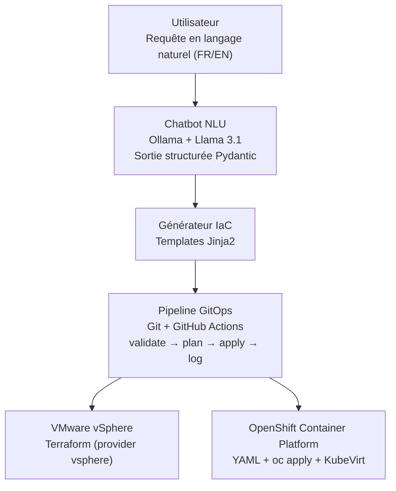

# Infrastructure as Code & Automation pilotée par Chatbot Intelligent

**Cahier des charges technique — brief de projet pour implémentation assistée (Antigravity)**

> Stage d'été · basé sur un sujet de PFE existant · réalisation 100% gratuite / open-source · durée indicative ~12 semaines

---

## 1. Résumé exécutif

Le sujet est réalisable à 100% avec des outils gratuits, mais pas forcément là où on l'imagine spontanément. La partie chatbot (compréhension du langage naturel, extraction de paramètres) est en réalité la brique la plus simple avec l'environnement déjà en place (Ollama + Llama 3.1). Le véritable défi technique consiste à obtenir un vSphere et un OpenShift qui acceptent réellement d'être pilotés par API/Terraform, gratuitement, sur une machine à 16 Go de RAM (32 Go disponible ponctuellement pour les jalons les plus lourds).

Ce document combine :
- le cahier des charges fonctionnel d'origine (sujet de stage) ;
- l'analyse de faisabilité technique qui en découle, avec les arbitrages nécessaires pour rester 100% gratuit sur le matériel disponible.

Il est structuré pour servir de contexte de départ à un agent d'implémentation (Antigravity ou équivalent).

## 2. Objectifs du projet

- Automatiser le provisioning d'infrastructure
- Supporter machines virtuelles et conteneurs
- Unifier la gestion VMware et OpenShift
- Simplifier les opérations IT via le langage naturel
- Introduire l'IA dans l'automatisation cloud
- Garantir standardisation, traçabilité et fiabilité (déploiements reproductibles, réduction des erreurs humaines)

## 3. Environnement de développement disponible

| Élément | Détail |
|---|---|
| Machine principale | Windows, 16 Go RAM |
| Machine de secours | 32 Go RAM (emprunt ponctuel — à réserver aux jalons lourds) |
| LLM local | Ollama, modèle `llama3.1:latest` (4.9 Go) déjà installé |
| Langage | Python 3.13.7 / pip 25.2 |
| Éditeur | VS Code |
| Contrôle de version | Git installé |
| Accès étudiant | GitHub Student Developer Pack actif (crédits Azure ~100$, DigitalOcean ~200$, minutes GitHub Actions boostées) |
| Contrainte budget | 0€ — aucune licence payante à aucune étape |

## 4. Périmètre fonctionnel

### 4.1 Chatbot conversationnel
Point d'entrée unique de la plateforme. Il doit :
- Comprendre les requêtes en langage naturel, en français et en anglais
- Identifier le type de ressource demandé : machine virtuelle ou conteneur
- Déterminer la plateforme cible : VMware vSphere ou OpenShift Container Platform
- Extraire les paramètres techniques : CPU, RAM, stockage, image, réseau
- Générer dynamiquement le code Infrastructure as Code correspondant

### 4.2 Environnement VMware vSphere
- Création automatisée de machines virtuelles
- Configuration des ressources et du réseau
- Gestion cohérente du cycle de vie des VM

### 4.3 Environnement OpenShift Container Platform
- Déploiement d'applications conteneurisées (pods, services, deployments)
- Création de machines virtuelles via OpenShift Virtualization (KubeVirt)
- Gestion unifiée des workloads VM et conteneurs

### 4.4 Pipeline d'automatisation
Les déploiements doivent être exécutés via un pipeline intégrant : validation, journalisation, contrôle.

### 4.5 Fonctionnement global attendu
1. L'utilisateur formule une demande via le chatbot
2. Le chatbot analyse et structure la requête
3. Le type de ressource et la plateforme sont identifiés
4. Le code Infrastructure as Code est généré
5. Validation et exécution du déploiement
6. La ressource est créée et mise à disposition

## 5. Architecture technique proposée



## 6. Spécification détaillée par composant

### 6.1 NLU / Extraction de paramètres

- **Modèle** : Ollama + `llama3.1:latest` (déjà installé, aucun téléchargement supplémentaire nécessaire)
- **Méthode** : sortie structurée forcée via le paramètre `format` d'Ollama, en lui passant un schéma JSON généré depuis un modèle Pydantic — plus fiable qu'un JSON en freeform
- **Validation métier** : contraintes de type `Field(ge=1, le=32)` pour couvrir l'étape de validation attendue dans le sujet

Snippet de référence (fonctionne tel quel avec l'installation actuelle) :

```python
from pydantic import BaseModel, Field
from typing import Literal, Optional
import ollama

class DemandeRessource(BaseModel):
    resource_type: Literal["vm", "container"]
    platform: Literal["vsphere", "openshift"]
    cpu: int = Field(ge=1, le=32)
    ram_gb: int = Field(ge=1, le=256)
    storage_gb: int = Field(ge=1, le=2000)
    image: str
    network: Optional[str] = "default"

prompt = "Crée-moi une VM Ubuntu avec 4 CPU et 8 Go de RAM sur vSphere, 50 Go de disque"

reponse = ollama.chat(
    model="llama3.1",
    messages=[{"role": "user", "content": prompt}],
    format=DemandeRessource.model_json_schema(),
)
demande = DemandeRessource.model_validate_json(reponse.message.content)
print(demande)
```

Installation : `pip install ollama pydantic fastapi uvicorn`

### 6.2 Génération de l'Infrastructure as Code

| Cible | Techno | Détail |
|---|---|---|
| vSphere | Terraform (provider `vsphere`) ou OpenTofu | Terraform reste gratuit pour cet usage (seule la revente en tant que service concurrent est restreinte par la licence BSL) ; OpenTofu est l'alternative 100% open-source si besoin |
| OpenShift | Manifestes YAML (Deployment/Service pour conteneurs, CRD `VirtualMachine` pour KubeVirt) | Générés depuis des templates Jinja2, appliqués via `oc apply` |

⚠️ Point d'attention : le paramètre "réseau" extrait par le chatbot ne se traduit pas de la même façon des deux côtés — port group / vSwitch côté vSphere, Service / Route côté OpenShift. Prévoir deux mappings distincts dans le générateur.

### 6.3 Pipeline GitOps

- Repo Git local, poussé vers GitHub (minutes Actions gratuites, boostées par le Student Pack)
- Étapes : `validate` → `plan` (dry-run) → `apply` → `log`
- Historique des requêtes : SQLite ou logs JSON, pour couvrir la traçabilité demandée dans le sujet

### 6.4 Cible VMware vSphere — le vrai point dur du projet

L'ESXi gratuit (revenu depuis avril 2025, version 8.0 Update 3e) bloque les opérations d'écriture via l'API : accès lecture seule uniquement via PowerCLI/API, ce qui exclut toute création de VM scriptée et donc tout pipeline IaC. Deux solutions gratuites complémentaires :

1. **Développement / tests quotidiens → vcsim** : simulateur d'API vCenter du projet officiel `vmware/govmomi`, zéro VM réelle, démarre en quelques secondes.
   - À builder via `go install github.com/vmware/govmomi/vcsim@latest`, ou via une image Docker communautaire (plusieurs forks existent — aucune n'est "officielle", à tester : `satak/vcsim`, `cybexer/vcsim`, `omniproc/vcsim`)
   - Fonctionne avec Terraform pour la création simple de VM ; le clonage depuis template et la configuration vApp ont un historique de bugs connus (issues ouvertes côté `terraform-provider-vsphere` et `govmomi`) — suffisant pour prouver le pipeline de bout en bout, pas pour un clonage 100% réaliste
2. **Démo "en vrai" → ESXi imbriqué en mode évaluation** : 60 jours, API complète débloquée (c'est un essai du produit payant), hébergé dans VMware Workstation Pro (gratuit en usage personnel). Se relance tous les 60 jours (pratique standard en homelab). À réserver au PC de 32 Go.
   - En option, si la RAM le permet, ajouter un vCenter Server Appliance en mode "Tiny" (~12 Go à lui seul) permet une démo à fidélité complète incluant le clonage de template — sinon un ESXi seul (sans vCenter) suffit pour piloter les VM via l'API, govmomi/pyVmomi/le provider Terraform vsphere fonctionnant directement contre un hôte ESXi standalone.

### 6.5 Cible OpenShift — deux niveaux de difficulté

**Conteneurs (facile)** :
- Red Hat Developer Sandbox : gratuit, instantané, zéro install — mais sans installation d'opérateur, quotas limités, pas d'accès cluster-admin. Parfait pour un premier prototype (S7-S8).
- OpenShift Local (CRC) : outil officiel gratuit, contrôle total. Minimum recommandé par Red Hat : 4 cœurs physiques, 9 Go RAM rien que pour démarrer le cluster (16 Go conseillés côté machine hôte, 32 Go si d'autres outils tournent en parallèle), 35 Go disque. Jouable sur le PC de 16 Go si peu d'autres applications tournent en même temps.

**VM via OpenShift Virtualization / KubeVirt (le jalon le plus lourd du projet)** :
- Possible sur CRC, mais très gourmand : des retours d'expérience documentent jusqu'à ~22 Go dédiés à l'instance CRC elle-même (hébergée dans une VM à 24 Go).
- Sur Windows, CRC utilise Hyper-V (pas KVM) — Hyper-V supporte la virtualisation imbriquée mais nécessite une configuration PowerShell explicite, non automatique.
- **Recommandation** : traiter ce jalon à part, le tenter sur le PC de 32 Go avec une marge de temps dédiée, et prévoir un plan B assumé (réduction de scope, documentation de la limite matérielle rencontrée) — c'est un arbitrage d'ingénierie tout à fait légitime à justifier dans un rapport de stage.

### 6.6 Plan de secours cloud

Si le matériel local bloque vraiment (notamment pour le jalon KubeVirt) : le GitHub Student Developer Pack donne accès à des crédits Azure (~100$) et DigitalOcean (~200$, valable un an), suffisants pour louer ponctuellement une VM cloud avec virtualisation imbriquée activée, le temps de valider ce jalon spécifique.

## 7. Stack technique récapitulative

| Composant | Techno retenue | Statut |
|---|---|---|
| LLM local | Ollama + llama3.1:latest | ✅ Déjà installé |
| Langage backend | Python 3.13 | ✅ Déjà installé |
| Framework API | FastAPI + Uvicorn | À installer |
| Validation / schémas | Pydantic v2 | À installer |
| IaC VMware | Terraform (provider vsphere) / OpenTofu | À installer |
| IaC OpenShift | YAML + Jinja2 + CLI `oc` | À installer |
| CI/CD | GitHub Actions | ✅ Compte GitHub Student Pack actif |
| Simulation vSphere | vcsim (govmomi) | À builder/installer |
| Démo vSphere réelle | ESXi éval 60j sur VMware Workstation Pro | À installer (PC 32 Go) |
| Dev OpenShift | Red Hat Developer Sandbox | À créer un compte |
| Contrôle total OpenShift | OpenShift Local (CRC) | À installer |
| VM sur OpenShift | OpenShift Virtualization (KubeVirt) | Jalon final (PC 32 Go) |
| Historique / audit | SQLite ou logs JSON | À implémenter |
| Secours cloud | Azure / DigitalOcean (Student Pack) | Disponible si besoin |

## 8. Feuille de route indicative (~12 semaines)

| Semaines | Livrable |
|---|---|
| S1–S2 | Setup : vcsim, CRC ou Developer Sandbox, repo Git, squelette FastAPI, validation du snippet NLU |
| S3–S4 | Chatbot NLU robuste : variantes FR/EN, validation Pydantic, tests sur un corpus large de phrases |
| S5–S6 | Génération Terraform pour vSphere, testée contre vcsim |
| S7–S8 | Génération YAML pour OpenShift (conteneurs), testée contre Sandbox/CRC |
| S9–S10 | Jalon KubeVirt (PC 32 Go requis), plan B prêt en cas de blocage matériel |
| S11 | Pipeline GitHub Actions complet + démo vSphere "en vrai" (ESXi en évaluation) |
| S12 | Interface chat finalisée, tests de bout en bout, rédaction du rapport de stage |

## 9. Risques identifiés & mitigation

| Risque | Impact | Mitigation |
|---|---|---|
| ESXi gratuit bloque les écritures API | Bloque tout provisioning vSphere réel | vcsim en dev, ESXi imbriqué en évaluation pour la démo |
| RAM insuffisante pour KubeVirt + CRC | Jalon final compromis | Isoler le jalon, l'exécuter sur le PC 32 Go, plan B documenté |
| Virtualisation imbriquée fragile sous Hyper-V | Instabilité de CRC + KubeVirt | Configurer Hyper-V explicitement, tester tôt, documenter |
| Bug connu Terraform + vcsim (clonage template/vApp) | Limite la fidélité des tests | Création simple de VM sous vcsim ; clonage réservé à l'ESXi en évaluation |
| Modèle 8B imprécis sur requêtes ambiguës | Erreurs d'extraction de paramètres | Sortie structurée stricte + contraintes Pydantic + corpus de tests FR/EN varié |
| Licence Terraform (BSL) | Non-bloquant ici | Usage interne/stage non concerné ; OpenTofu en secours si besoin |
| Blocage matériel total sur le jalon KubeVirt | Retard sur le planning | Crédits Azure/DigitalOcean du Student Pack pour une VM cloud temporaire |

## 10. Critères de succès (Definition of Done)

**Fonctionnels (issus du sujet)** :
- [ ] Plateforme IaC multi-environnements opérationnelle
- [ ] Déploiement automatisé de VM sur VMware (vcsim et/ou ESXi en évaluation)
- [ ] Déploiement automatisé de VM et conteneurs sur OpenShift
- [ ] Chatbot intelligent de provisioning fonctionnel en français et en anglais
- [ ] Réduction mesurable du temps de déploiement par rapport à une procédure manuelle
- [ ] Diminution des erreurs humaines, tracée via les logs du pipeline

**Techniques (acceptance criteria)** :
- [ ] Extraction correcte des paramètres (resource_type, platform, cpu, ram_gb, storage_gb, image, network) sur un corpus de test FR + EN
- [ ] Le pipeline GitHub Actions exécute automatiquement validate → plan → apply → log à chaque requête validée
- [ ] Le code Terraform généré passe systématiquement `terraform validate`
- [ ] Le code YAML généré passe `kubectl apply --dry-run=client` sans erreur
- [ ] L'historique des requêtes est consultable et permet de rejouer/auditer chaque déploiement

## 11. Structure de dépôt suggérée

```
iac-chatbot/
├── backend/
│   ├── app/
│   │   ├── main.py
│   │   ├── nlu.py
│   │   ├── models.py
│   │   ├── generators/
│   │   │   ├── terraform_gen.py
│   │   │   └── openshift_gen.py
│   │   └── history.py
│   └── requirements.txt
├── iac_templates/
│   ├── terraform/
│   │   └── vm.tf.j2
│   └── openshift/
│       ├── deployment.yaml.j2
│       └── virtualmachine.yaml.j2
├── .github/
│   └── workflows/
│       └── pipeline.yml
├── docs/
└── README.md
```

## 12. Notes pour l'agent d'implémentation

- Respecter l'ordre de la feuille de route : chaque jalon dépend de la stabilité du précédent
- Avant d'ajouter une dépendance, vérifier qu'elle reste 100% gratuite pour cet usage
- Le jalon KubeVirt (S9-S10) nécessite le PC 32 Go : confirmer sa disponibilité avant de commencer, sinon basculer sur le plan B
- Prioriser vcsim pour toutes les itérations de développement — ne pas dépendre d'un ESXi réel avant la phase de démo finale
- Documenter chaque contournement technique (limitations vcsim, config Hyper-V, etc.) : ces arbitrages ont de la valeur dans le rapport de stage final

## Annexe A — Commandes d'installation indicatives

> À valider/adapter selon les paquets réellement disponibles au moment de l'implémentation.

```powershell
# Backend Python
pip install fastapi uvicorn ollama pydantic --upgrade

# Terraform (ou l'alternative 100% open-source OpenTofu)
winget install Hashicorp.Terraform
# winget install OpenTofu.OpenTofu

# CLI OpenShift
winget install RedHat.OpenShift-CLI

# vcsim (nécessite Go)
go install github.com/vmware/govmomi/vcsim@latest
```

---

*Document compilé à partir du sujet de stage original et de l'analyse de faisabilité technique effectuée en amont. Les arbitrages proposés (vcsim plutôt qu'un vSphere réel pour le développement, priorisation du jalon KubeVirt, etc.) peuvent valoir la peine d'être validés avec ton encadrant de stage avant de lancer l'implémentation.*
